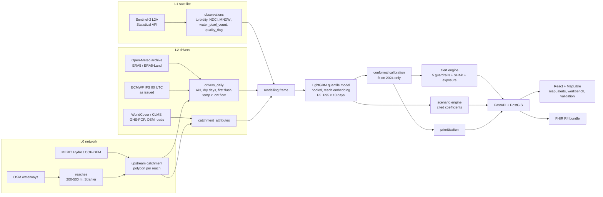
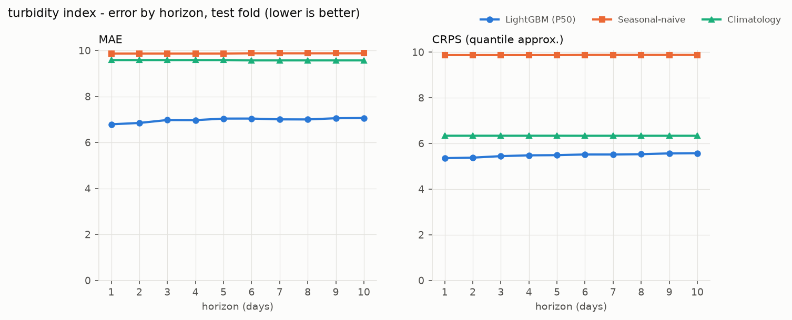
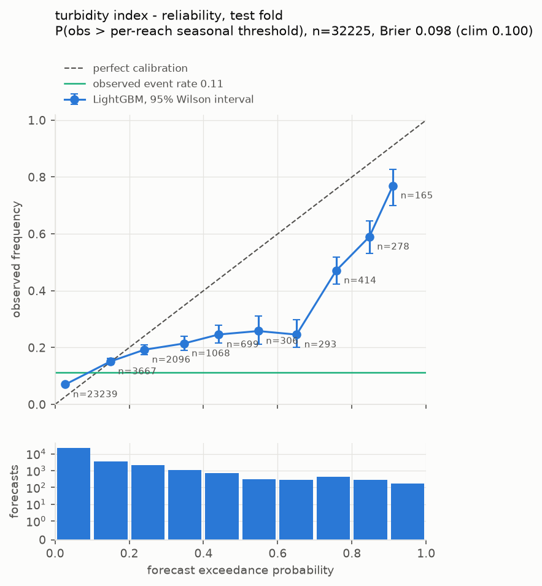

# Kingfisher

**Kingfisher watches the water continuously, warns before the water turns, and shows what
to change so it turns less often.**

An early-warning and resilience-planning system for urban streams.
Built for the **OneAquaHealth IEEE Global Hackathon 2026 — Track 6: Resilience Informatics**
(*Enable early warning & resilience planning · Gap: lack of predictive environmental tools ·
Expected: predictive dashboards, alerts, and resilience tools*).

> **Live demo: [huggingface.co/spaces/areyousheeeee/kingfisher](https://huggingface.co/spaces/areyousheeeee/kingfisher)**
> ([open full screen](https://areyousheeeee-kingfisher.static.hf.space)). Map, alerts,
> hydrographs, attribution, validation and FHIR export for Coimbra and Pune. It is a
> static snapshot of the production system at the 20 Sep 2026 alert run: every response was
> saved from the real API, and the scenario workbench replays 12 scenarios run by the real
> engine. Arbitrary scenario runs need the full system ([Running it](#11-running-it)).

| | |
|---|---|
| **Predict** | A 10-day forecast of turbidity and chlorophyll (NDCI) for every reach of an urban stream network, with prediction intervals (P5 to P95) |
| **Warn** | Exceedance-probability alerts with five guardrails, driver attribution (SHAP), exposure context, and a first-class `INSUFFICIENT_EVIDENCE` refusal |
| **Adapt** | A scenario workbench: pick reaches on the map, apply interventions whose effect sizes come from cited literature, and see the change in exceedance days with widened intervals |
| **Where** | Coimbra, Portugal (353 reaches, primary) and Pune, India (312 reaches, a transfer to a different continent and climate with a config file) |
| **How it is judged** | Walk-forward validation on held-out years (train ≤ 2023, validate 2024, test 2025–26) against seasonal-naive and climatology. Every loss is published. |

> **Headline result (Coimbra, held-out 2025–26 test fold).** The forecast beats
> seasonal-naive persistence by **44–45 % CRPS for turbidity and 47–49 % for chlorophyll**,
> and beats a per-reach seasonal climatology by **12–15 % and 15–19 %**, at every lead
> time from 1 to 10 days. The same holds with the ECMWF forecast weather a live system
> would have had: the model still wins at lead days 1–7 but ties climatology at 8–10 days
> for turbidity. Conformal calibration brings the served 80 % interval to **0.76–0.78
> coverage** on held-out data (0.55–0.61 before). The places where Kingfisher loses are
> listed in [Where it loses](#where-it-loses) rather than left out.

---

## Contents

1. [The problem](#1-the-problem)
2. [Why this is a Track 6 problem](#2-why-this-is-a-track-6-problem)
3. [The solution](#3-the-solution)
4. [The constraint that shapes everything: 10 m pixels, 5 m streams](#4-the-constraint-that-shapes-everything-10-m-pixels-5-m-streams)
5. [Architecture](#5-architecture)
6. [Technical details, layer by layer](#6-technical-details-layer-by-layer)
7. [Results](#7-results)
8. [How Kingfisher helps, and the One Health link](#8-how-kingfisher-helps-and-the-one-health-link)
9. [What Kingfisher does not do](#9-what-kingfisher-does-not-do)
10. [Limitations](#10-limitations)
11. [Running it](#11-running-it)
12. [Repository layout and tests](#12-repository-layout-and-tests)
13. [Attribution and licences](#13-attribution-and-licences)

---

## 1. The problem

**Urban stream monitoring is episodic. Urban stream failure is episodic. The two do not
line up.**

Professional sampling runs on a calendar, and citizen observation runs on whoever happens
to walk past. The events that damage urban freshwater ecosystems run on the weather's
schedule instead:

- **First-flush runoff.** After a dry spell, the first intense rain washes weeks of
  accumulated road dust, sediment and contaminants off impervious surfaces in minutes.
- **Storm overflows and illicit discharges**, which happen in hours and are gone by the
  next sampling visit.
- **Summer eutrophication.** Low flow and high temperature let algae bloom, oxygen crash
  and fish die.

A stream can fail on a Tuesday and be sampled a month later, by which time the water, and
the evidence, have moved on. OneAquaHealth's own work across 100 urban stream sites in
five European cities shows this gap. Pharmaceuticals were detected at 91 % of monitored
sites, and diatom deformities had to be used as an early-warning indicator because
routine monitoring misses what happens between visits.

City managers also have no tool that answers the follow-up questions:

- *Which reaches will be in trouble in the next ten days?*
- *Where is the next field visit worth most?*
- *If we restore this riparian buffer or build that detention basin, how much less often
  does this stream exceed its normal range?*

**The gap is not a lack of data. It is detection latency, plus no tool that says what to
change.**

## 2. Why this is a Track 6 problem

Track 6 (Resilience Informatics) names the gap as a *lack of predictive environmental
tools*. It asks for *predictive dashboards, alerts, and resilience tools* that *enable
early warning and resilience planning*. Kingfisher is built around those three words, and
each one maps to a working, tested subsystem:

| Track 6 asks for | Kingfisher delivers | Where it lives |
|---|---|---|
| **Predictive dashboards** | Reach-level 10-day forecasts with P5–P95 intervals on an interactive map. A hydrograph rail scrubs through past observations and forecast days. Every validation metric is served live from the evaluation output, not from a screenshot. | `models/baseline_gbm.py`, `api/routes/reaches.py`, `api/routes/validation.py`, `frontend/src/views/MapView.tsx`, `ValidationView.tsx` |
| **Alerts** | Calibrated exceedance probability against each reach's own seasonal normal. Five guardrails (staleness, drift, confidence, cooldown, observability), SHAP driver attribution, and exposure context: schools, playgrounds, footpaths, water access points and population within 250 m. | `engine/alerts.py`, `engine/alert_run.py`, `engine/exposure.py`, `AlertsView.tsx` |
| **Resilience tools** | A scenario workbench with five literature-cited interventions (riparian buffers, permeable paving, detention basins, street sweeping, green roofs). Each result is a change in exceedance days with a widened interval, cost in the source currency, and the citation shown next to the number. Also a ranked "where is the next field visit worth most" list. | `engine/scenarios.py`, `config/intervention_coefficients.yaml`, `engine/priorities.py`, `ScenarioView.tsx` |
| **Early warning** | Forecasts issued daily on the ECMWF IFS 00 UTC run that a live system would actually have (weather label `LIVE`), with 1–10 days of lead time | `pipeline/asissued_weather.py`, `make live-weather forecasts-latest alerts` |
| **Resilience planning** | Planning estimates for interventions, labelled as estimates, with the model's own inability to size some levers reported instead of hidden | `models/scenario_response.py`, [Scenario response check](#74-adapt-can-the-model-be-trusted-to-size-an-intervention) |

It also matches the OneAquaHealth consortium's stated mission, an AI-based environmental
surveillance system built on early-warning indicators for urban freshwater. Kingfisher's
FHIR export connects that surveillance to the health-data side of One Health (§6.13).

## 3. The solution

Kingfisher combines two data regimes, neither of which is enough alone:

- **Satellite data is continuous but shallow.** Sentinel-2 revisits every 5 days, is
  free, and goes back to 2015, but it only sees what water looks like: turbidity,
  chlorophyll and water extent. It will never see a pharmaceutical.
- **Weather drives stream state and is available everywhere, every hour.** That includes
  rain intensity, dry spells, antecedent soil wetness, temperature and evaporation, both
  observed (ERA5) and forecast (ECMWF IFS).

Kingfisher learns **driver → state**. It learns how the weather falling on a reach's
*upstream catchment*, combined with that catchment's land cover, turns into the optical
state of the reach. It then forecasts that state 10 days ahead, warns when the forecast
is likely to exceed the reach's own seasonal normal, and lets planners change the
catchment to see what an intervention would do.

```
catchment weather forcing (rain, dry spells, first flush, soil moisture, heat)
      x  static catchment attributes (imperviousness, riparian vegetation, roads, population)
      -> forecast reach state (turbidity index, chlorophyll index) with intervals
      <- corrected by satellite observations wherever the channel is visible
```

Driver → state, rather than time-series extrapolation, is a forced choice (§4), and it
pays off twice:

1. Reaches too narrow for the satellite to see are **still forecast** from their weather
   and catchment.
2. Catchment attributes are model **inputs**, so they can be perturbed. That is what
   makes the scenario engine possible at all.

### The five things that make Kingfisher different

1. **Upstream catchments, not buffers.** Weather and land cover are aggregated over each
   reach's hydrologically delineated upstream contributing catchment, because that is the
   area that drains into the reach. Most entries will use a circle around the stream.
2. **Observability is measured and reported.** Every reach-date stores how many clean
   water pixels the satellite actually saw. Reaches the satellite cannot see are still
   forecast, but they are capped at `WATCH` severity and reported as a separate group.
3. **The system is allowed to refuse.** `INSUFFICIENT_EVIDENCE` is a first-class outcome.
   It appears on the map, is counted in the metrics, and is never turned into a
   low-confidence alert.
4. **No model invents an intervention effect.** Scenario effect sizes come only from a
   YAML table in which every number carries a citation, a locator ("abstract, table 2")
   and a `supports` claim. The code refuses to load an uncited number. When the model's
   own response to a land-cover change points the wrong way, Kingfisher says so and marks
   that lever `NOT_ESTIMABLE`.
5. **No LLM computes a number.** Every value comes from a model or deterministic code.

## 4. The constraint that shapes everything: 10 m pixels, 5 m streams

Sentinel-2's finest bands are 10 m, and urban streams are often 3–8 m wide. A pixel that
straddles a stream mixes water, bank, road and roof, so its "turbidity" means nothing.
Kingfisher does not pretend otherwise:

- Every reach-date stores `water_pixel_count`. Only pixels classified as water by both
  the Sentinel-2 scene classification and an MNDWI test are used.
- A **Day-1 observability gate** tags each reach as optically observable or driver-only.
- A missing reach-date is `NULL` with a `quality_flag`: `CLOUD`, `NO_WATER_PIXELS` or
  `OUT_OF_RANGE`. It is never zero and never forward-filled without a label.

| | Coimbra | Pune |
|---|---:|---:|
| Reaches in the network | 353 | 312 |
| Optically observable | **51 (14 %)** | **59 (19 %)** |
| Driver-only (still forecast, capped at WATCH) | 302 | 253 |
| Sentinel-2 reach-dates, usable (`OK`) | 14,141 | 16,069 |
| … lost to `CLOUD` | 19,761 | 17,549 |
| … lost to `NO_WATER_PIXELS` | 4,303 | 4,580 |
| … rejected as `OUT_OF_RANGE` | 11 | 241 |

**Only about one urban reach in six is visible from space at 10 m. This is a finding in
its own right**, about the limits of satellite monitoring for urban streams, and it is
reported rather than hidden. It is also why the model has to be driver-based.

## 5. Architecture



The design keeps a hard boundary between I/O and logic. `engine/` (alerts, guardrails,
scenarios, priorities, exposure, thresholds, probability) is **pure functions**: no
database, no network, no file access. The guardrails, the scenario rules and the
prioritisation can therefore be tested exhaustively without a server. `pipeline/` and
`models/` do the I/O, and `api/` sits behind a repository `Protocol`.

**Stack.** Python 3.11, FastAPI, PostGIS 16, GeoPandas, Shapely, rasterio,
`sentinelhub-py`, LightGBM, PyTorch + NeuralHydrology (EA-LSTM challenger), SHAP,
scikit-learn. Frontend: React 19 + TypeScript, Vite, MapLibre GL, Zustand, Tailwind,
Recharts.

## 6. Technical details, layer by layer

### 6.1 L0: the stream network and upstream catchments

- **Reaches.** OSM `waterway=river|stream|canal` lines inside the city bounding box are
  noded at confluences, assigned Strahler order, and split into 200–500 m reaches (target
  350 m). Reaches below Strahler order 2 are dropped because no 10 m sensor can see them.
- **`reach_id` is the universal key**: stable, string, and prefixed by city (`CMB-0041`,
  `PUN-0007`).
- **Upstream contributing catchments.** Each reach outlet is snapped to the flow
  accumulation grid, and its upstream area is delineated from precomputed flow
  direction. MERIT Hydro is the design source; Copernicus DEM GLO-30 is the fallback
  where MERIT access was pending. Flow direction is never derived by hand from a raw
  DEM. Catchments that break monotonicity (a downstream catchment smaller than an
  upstream one) or that snapped off the network are **flagged, not dropped**
  (`MONOTONICITY_VIOLATION`, `SNAP_OFF_STREAM_NETWORK`, `CATCHMENT_TRUNCATED`).
- **Topology** (`reach_topology`) links each reach to its direct upstream neighbours. It
  feeds the upstream-state feature and the driver-only staleness guardrail.

### 6.2 L1: Sentinel-2 water indices

- **The Sentinel Hub Statistical API**, not granule downloads. At about 1 GB per granule
  times hundreds of scenes, downloading would have eaten the whole timeline. Each request
  returns per-date statistics over a water mask inside the reach polygon, and every
  response is cached to disk, keyed by its request parameters, before it reaches a
  DataFrame.
- **Water mask**: SCL water class and MNDWI > 0. `water_pixel_count` is stored with every
  row.
- **Turbidity index**: the Nechad et al. single-band algorithm on B4 (red), with the
  ACOLITE coefficients for the S2 MSI red band (cited in `config/sentinel2.yaml`). It is
  shown as a *turbidity index* with no unit: it is a surface-reflectance proxy, not a calibrated nephelometric turbidity.
- **Chlorophyll index**: NDCI = (B5 − B4) / (B5 + B4) (Mishra & Mishra 2012).
- **Riparian NDVI**: one cloud-light composite window per reach-year for every reach
  (July in Coimbra; mid-October to mid-November in Pune, after the monsoon).
- **Platform QA**: a check for a level shift at the Sentinel-2C platform change
  (`scripts/check_s2_platform_shift.py`).
- Coverage: 2018–2026 for all observable reaches, 2016–17 probed on one reach.

### 6.3 L2: weather drivers over the upstream catchment

Weather is queried at each reach's **catchment centroid**, snapped to the 0.1° ERA5-Land
grid. Querying finer than the source grid gains nothing, and snapping cuts Coimbra's
requests roughly 35-fold. Hourly values are aggregated to UTC days, and the features are
defined exactly (the tests pin each one against hand-computed fixtures):

| Feature | Definition | Why it matters |
|---|---|---|
| `precip_mm`, `precip_max_hourly`, `precip_duration_h` | Daily sum, peak hour, hours > 0.5 mm | Intensity, not only totals, drives scour and overflows |
| `api_7`, `api_14`, `api_30` | Antecedent precipitation index Σ P(t−i)·0.9^i. Day t is excluded. NULL if any day is missing: a missing day is never read as a dry day. | Catchment wetness |
| `antecedent_dry_days` | Consecutive days before t with < 1 mm | Pollutant build-up on impervious surfaces |
| `first_flush_index` | `antecedent_dry_days × precip_max_hourly` | A dry spell broken by an intense storm is the classic urban first flush |
| `temp_low_flow_index` | `temp_mean × (1 − api_14 / max_api_14)`, with the maximum taken **over training dates only** | Warm, low-flow conditions favour algal growth; using the whole-series maximum would leak the test years |
| `soil_moisture`, `et0` | ERA5-Land | Runoff generation and drying |
| `doy_sin`, `doy_cos` | Seasonal harmonics | Seasonality |
| `upstream_state_lag1_*` | Catchment-area-weighted latest usable observation of the direct upstream reaches, at t−1 | Lets information from a visible upstream reach flow to a driver-only reach below it |

**Two weather sources, never mixed.** Training uses the archive (`ARCHIVE`); days after
the archive ends come from the forecast endpoint (`FORECAST`) and can never enter a
training fold. For evaluation, the ECMWF IFS 00 UTC runs *as issued* on each date since
March 2024 are rebuilt, so the model can be scored on the weather a live system would
really have had (`ASISSUED`), not only on observed weather (`ORACLE`).

### 6.4 L2: static catchment attributes

Imperviousness, riparian width, riparian NDVI, road density (motorised classes only),
night-time light, population and urban fraction, all over the upstream catchment. They
come through a **land-cover adapter chain**: Copernicus CLMS where available (EU), ESA
WorldCover 10 m otherwise (and for Pune). Every value records its adapter and flags. For
example, `PROXY_BUILT_UP_SHARE` means imperviousness was estimated from WorldCover
built-up share rather than a true imperviousness layer. **Adding a city requires a YAML
file and, at most, a land-cover adapter, nothing else.** Pune was added that way.

### 6.5 The forecast model

- **Pooled LightGBM quantile regression**, one model per (variable × horizon bucket ×
  quantile), trained across *all* reaches with a reach embedding. There are about 500
  usable timesteps per reach, far too few for per-reach models. Seven quantiles
  (P5, P10, P25, P50, P75, P90, P95), rearranged where they cross (every rearrangement is
  counted).
- **Inputs**: drivers at the issue date *and shifted to the target date*, statics, the
  last usable observation carried as a labelled as-of value with its age, upstream state,
  and horizon.
- **Two variants**, both reported:
  - **A** includes `reach_id`, the production forecaster.
  - **B** has no reach identity and is used for scenarios. A model that knows which reach
    it is looking at can ignore the catchment attributes, so it cannot tell you what
    changing them would do. A beats B by 7.6 % (turbidity) and 18 % (NDCI) test CRPS;
    that is the price of a scenario-capable model, and it is published.
- **Attribute honesty**: `urban_fraction` is dropped while it is only a built-up proxy.
  Night-time light is used only where a VIIRS composite exists.
- **Walk-forward folds**: validation = train ≤ 2023, score 2024; test = train ≤ 2024, score
  2025–2026; production = train on everything up to the issue date. There is no
  shuffling. Leakage tests assert that no target-date information enters a training row.
- **TreeSHAP** attributions are computed for the production P50 model and **stored**; the
  API serves the stored values and recomputes nothing.

### 6.6 Calibration

The raw quantile model is over-confident: its 80 % interval covers only 55–61 % of
held-out observations. Kingfisher fixes this with **split-conformal quantile regression**
(CQR, Romano, Patterson & Candès 2019):

- One fit per variable × horizon bucket × observability class, **fitted on the 2024
  validation fold only**. The code refuses any other row (`TestFoldTouched`).
- Applied to every variant-A forecast written to the database, which means the alert
  engine, the drift guardrail's calibration band and the API all use calibrated
  intervals.
- **Live forecasts use the fit from as-issued weather**, since a live forecast runs on
  forecast weather. A city without as-issued history (Pune) uses the observed-weather fit,
  and the record says it is a lower bound on the width needed.
- Held-out result: coverage rises from 0.55–0.61 to **0.76–0.78** (target 0.80).
  `results/calibration_production.json`.

A second step, isotonic recalibration of the exceedance probability, is fitted and scored
in the head-to-head (§7.2) and discussed honestly in §7.3. It is **not** applied to live
alerts. Why not is explained there.

### 6.7 Assimilation, and the EA-LSTM challenger

- **Residual assimilation**: where a reach has a recent observation, the forecast is
  nudged by its recent error, which decays with lead time. The decay τ is fitted on 2024
  only. It helps the EA-LSTM and adds nothing to LightGBM, and that result is reported.
- **EA-LSTM** (Entity-Aware LSTM, NeuralHydrology 1.13, 5 seeds × 2 targets, trained on a
  Colab T4) was the planned upgrade. A **production gate was fixed before the test fold
  was scored**: the challenger must win at least 2 of 3 horizon buckets for *both*
  targets, with coverage no worse. It won 2 of 3 for NDCI (missing the coverage test by
  0.00006) and **0 of 3 for turbidity**, so **LightGBM stays in production**. Both models
  are reported (§7.2).

### 6.8 Anomaly detection: what the weather cannot explain

A high reading after a storm is expected. A high reading on a dry, cool day is not. The
detector scores each observation's probability integral transform (PIT) against the
weather-driven forecast. It labels an observation `UNEXPLAINED` when it lies far above
what the weather predicts, and `WEATHER_EXPLAINED` when it is high but the forecast
expected it. It then checks whether the anomaly is **localised** (upstream and downstream
reaches normal) or spatially coherent. Labels only: **no source or polluter is ever
named.** No incident log existed for scoring, so the reference is a labelled *proxy*: the
reach-season 95th percentile.

### 6.9 The alert engine and guardrails

For each reach, variable and target day, the calibrated quantiles give a full predictive
CDF, and **P(exceed)** is read from it against the reach's **own seasonal threshold**:
the 90th percentile of that reach's usable observations in that meteorological season,
fitted on the fitting period only. The threshold is never borrowed from a neighbour.
Then the guardrails run in a fixed order, taken from a payments policy-engine pattern:

| Guardrail | Rule | Outcome |
|---|---|---|
| **Staleness** | Last usable observation (for a driver-only reach, its upstream evidence) older than 21 days, or none at all | `INSUFFICIENT_EVIDENCE` |
| **Drift** | Recent residuals leave the calibration band (mean \|z\| > 2.5 or > 50 % outside P10–P90) | Suppressed |
| **Confidence** | Peak P(exceed) < 0.60 | Suppressed |
| **Cooldown** | An ALERT/WATCH for the same reach and variable in the last 72 h | Suppressed |
| **Observability** | A reach not proven optically observable | Capped at `WATCH` |

Each alert carries its **basis**: threshold derivation, the model version, the weather
source, where the drift residuals came from, the top SHAP drivers at the peak day (in the
target's units), and **exposure** within 250 m. Every run is recorded in `alert_runs`,
including the counts suppressed per guardrail, so "no alerts" is never confused with
"no run".

### 6.10 Exposure pathways

For every reach, OSM schools, kindergartens, playgrounds, parks, healthcare sites,
footways, cycleways and water access points (fords, slipways, swimming areas) within a
250 m buffer, with counts and nearest distance, plus GHS-POP population. Summed over reach
buffers (so overlapping buffers count twice), Coimbra has about 35,000 people, 40 schools
and 25 playgrounds, and Pune has 1.6 million people, 121 schools and 373 healthcare sites. This is where people come into contact with the
water. **It is not a health risk score.**

### 6.11 The scenario engine (Adapt)

The engine separates the model from the intervention physics, because a statistical model
has no right to invent the effect of a green roof.

1. **Coefficient table** (`config/intervention_coefficients.yaml`): five levers, each
   with magnitude, an uncertainty range, applicability conditions, cost in source
   currency (USD stays USD, never silently converted) and full references. Every number
   must be claimed by a reference's `supports` list, or the file refuses to load.
   Daylighting is listed as `not_quantified` because the literature has no usable
   effect size.
2. **A lever changes an input.** For example, detention cuts `precip_max_hourly`, which
   recomputes `first_flush_index` downstream of it.
3. **The binding response check** (`make response-check`) decides, per
   lever and variable, whether the model may be used:
   - `MODEL_PERTURBATION`: the model's response has the literature sign and is not
     negligible, so the model is re-run with the perturbed input.
   - `LITERATURE_DIRECT`: the model is not trusted, but a cited direct effect on stream
     state exists, so that is applied.
   - `NOT_ESTIMABLE`: neither, and the result says so with the check shown alongside.
4. **Output**: change in exceedance days over the window (the sum of daily P(exceed), with
   a Poisson-binomial interval) per reach. The scenario interval is 1.5 × the larger of
   its own and the baseline width, so it is strictly wider than the baseline, and the
   caveat is shown in the UI rather than hidden in a tooltip. Results are **planning
   estimates, not predictions**, and not causal claims. The effect is **not propagated
   downstream** yet, and every result says so.

### 6.12 Prioritisation

`information_value = forecast_uncertainty × predicted_risk × exposure_weight` ranks where
the next field visit or citizen-science sample is worth most. The weights live in
`config/priorities.yaml` and are labelled a planning choice, not a risk score.

### 6.13 API, frontend and FHIR

- **FastAPI**, 16 API routes plus `/health`: `/api/cities`, `/api/reaches` (GeoJSON with current status),
  `/api/reaches/{id}` (plus `/forecast`, `/catchment`, `/attribution`), `/api/alerts`
  (including `INSUFFICIENT_EVIDENCE` and suppressed counts), `/api/alerts/{id}`,
  `POST /api/scenarios`, `/api/scenarios/{id}`, `/api/scenarios/interventions`,
  `/api/priorities`, `/api/exposure`, `/api/timeline`, `/api/validation/metrics`,
  `/api/export/fhir/{alert_id}`. Pydantic models sit at every boundary.
  `/api/validation/metrics` reads the evaluation output on every request and returns its
  sha256, so the UI shows exactly what the evaluation produced.
- **Frontend** (React + MapLibre), four views:
  - **Map**: the network coloured by exceedance probability. Hatched reaches mean
    `INSUFFICIENT_EVIDENCE`. Catchment on hover, a reach drawer with the fan chart, SHAP
    bars, catchment card, exposure list and an observability badge, and a hydrograph rail
    that scrubs the map through time.
  - **Alerts**: severity-sorted, with refusals shown.
  - **Scenario workbench**: click or lasso reaches, choose levers and extents, then swipe
    before/after, with per-reach days, intervals, costs and citations.
  - **Validation**: reliability diagram, skill table including losses, anomaly P/R/F1,
    and observable versus driver-only results.
- **FHIR R4 export**: an alert becomes a FHIR `Bundle` of `Observation` (the exceedance
  probability, threshold and window), `Location` (the reach geometry) and `Device`
  (model version and provenance). An environmental early warning can then enter a health
  information system in the format it already speaks.

## 7. Results

All numbers come from `results/` and are served live by `/api/validation/metrics`.
Coimbra is the primary city. *Test* = 2025–2026, never seen by any fit, threshold,
calibration or gate decision. `ORACLE` = observed weather for the target days (an upper
bound on live skill). `ASISSUED` = the ECMWF forecast actually issued that morning (what
a live system gets). CRPS scores the whole predictive distribution; skill = 1 −
model / baseline, so skill > 0 means Kingfisher wins.

### 7.1 Predict: forecast skill on the held-out test fold (Coimbra, variant A)

**CRPS skill against seasonal-naive persistence** (last observation carried forward):

| Target | Weather | Lead 1–3 d | Lead 4–7 d | Lead 8–10 d |
|---|---|---:|---:|---:|
| Turbidity index | observed (ORACLE) | **+45.4 %** | **+44.3 %** | **+43.8 %** |
| Turbidity index | as issued (live) | **+44.1 %** | **+41.6 %** | **+34.4 %** |
| Chlorophyll (NDCI) | observed (ORACLE) | **+49.2 %** | **+47.7 %** | **+46.9 %** |
| Chlorophyll (NDCI) | as issued (live) | **+46.0 %** | **+43.6 %** | **+41.0 %** |

**CRPS skill against per-reach seasonal climatology** (a much harder baseline):

| Target | Weather | Lead 1–3 d | Lead 4–7 d | Lead 8–10 d |
|---|---|---:|---:|---:|
| Turbidity index | observed (ORACLE) | **+14.9 %** | **+13.2 %** | **+12.3 %** |
| Turbidity index | as issued (live) | **+13.6 %** | **+9.3 %** | −1.2 % |
| Chlorophyll (NDCI) | observed (ORACLE) | **+18.8 %** | **+16.5 %** | **+15.2 %** |
| Chlorophyll (NDCI) | as issued (live) | **+11.5 %** | **+8.7 %** | **+7.1 %** |

Mean absolute error on the test fold at lead 1–3 days: turbidity index 6.87 (seasonal-naive
9.87, climatology 9.58); NDCI 0.100 (0.148, 0.125). Rows: 9,639 test reach-forecasts per
lead bucket for ORACLE, 4,276 for as-issued weather (as-issued history starts March
2024).

**What this means.** Kingfisher carries real forecast skill from the weather to 10 days
ahead. Skill decays gently with lead time, which is what a physically driven forecast
should do. With real forecast weather, turbidity loses its edge over climatology at day
8–10, because the rain forecast itself loses skill. Chlorophyll depends on slower drivers
(temperature, low flow) and keeps its skill.



### 7.2 Head-to-head: LightGBM against the EA-LSTM, decided before test was opened

Validation CRPS (2024), both models assimilated and conformally calibrated identically:

| Validation CRPS (lower is better) | EA-LSTM + assim | LightGBM + assim | Winner |
|---|---:|---:|---|
| NDCI, 1–3 d | 0.0630 | 0.0625 | LightGBM |
| NDCI, 4–7 d | 0.0652 | 0.0668 | EA-LSTM |
| NDCI, 8–10 d | 0.0679 | 0.0701 | EA-LSTM |
| Turbidity index, 1–3 d | 5.039 | 4.603 | LightGBM |
| Turbidity index, 4–7 d | 4.844 | 4.684 | LightGBM |
| Turbidity index, 8–10 d | 4.833 | 4.817 | LightGBM |

The gate needed 2 of 3 buckets for *both* targets, so **LightGBM stays in production**.
On the test fold the gap widens: LightGBM CRPS 0.075 against EA-LSTM + assimilation
0.079 (NDCI), and on spatial-holdout reaches the EA-LSTM's 80 % coverage drops to
0.67–0.75. The EA-LSTM had only 6 usable static attributes to tell reaches apart, which
limits an entity-aware model. `results/head_to_head.json`, `results/gate.json`.

### 7.3 Warn: probability calibration and the operating point

**Intervals.** The served 80 % interval (conformal, fitted on 2024) covers **0.76–0.78** of
held-out test observations, against 0.55–0.61 for the raw model:

| 80 % interval coverage, test fold | Raw model | Served (calibrated) |
|---|---:|---:|
| Turbidity index, observed weather | 0.55 | **0.76** |
| Turbidity index, as-issued weather | 0.55 | **0.78** |
| NDCI, observed weather | 0.61 | **0.77** |
| NDCI, as-issued weather | 0.60 | **0.78** |

**Exceedance probabilities.** The Brier skill against the climatological event frequency
on the test fold, and what isotonic recalibration (fitted on 2024 only) would add:

| Brier skill vs climatology, test | Observed weather | As-issued weather | As-issued + isotonic |
|---|---:|---:|---:|
| Turbidity index | +3.4 % | **−11.3 %** | +4.0 % |
| NDCI | +11.8 % | +1.7 % | +5.8 % |



**The honest reading.** The reliability diagram is the most important chart in this
README:

- **Chlorophyll probabilities are well calibrated.**
- **Turbidity probabilities are over-confident in the 0.3–0.7 range.** A forecast of
  0.45–0.65 comes true about 25 % of the time. Above 0.7 they become informative again
  (observed 0.47–0.77).
- With live forecast weather, raw turbidity probabilities are worse than climatology.

Isotonic recalibration fixes the Brier score, but it also means turbidity forecasts
almost never reach the 0.60 alert floor: 3 flags in 14,506 held-out as-issued
reach-forecasts. That floor was fixed before any of this was measured, and lowering it
now to recover alerts would be tuning on the test set.

So Kingfisher currently serves conformal-calibrated quantiles and publishes this result.
The trade-off, between recalibrated probabilities and an alert floor chosen on
validation data, is open work (§10).

At the 0.60 operating point, before guardrails, test fold, observed weather:

| Target | Flagged | False-alarm ratio | Probability of detection |
|---|---:|---:|---:|
| Turbidity index | 1,150 | 0.51 | 0.15 |
| NDCI | 604 | 0.41 | 0.14 |

The system is built to be **conservative**. It alerts rarely, and when it does, about
half to three-fifths of alerts are followed by an actual exceedance. Most exceedances are
not caught at 60 % confidence; the guardrails then remove more. The false-alarm rate
after guardrails and the lead-time distribution need an incident log to score, and are
listed as *not computed* rather than estimated.

**The live run of 2026-09-20 (Coimbra, forecast on the ECMWF run issued that
morning, `weather = LIVE`)**, 706 candidates (353 reaches × 2 variables):

| Outcome | Count | Why |
|---|---:|---|
| **ALERT** | 1 | CMB-0145 (Rio Mondego), turbidity index, peak P(exceed) 0.62 within 21–30 Sep. Exposure: 1 school at 189 m, 5 footways, 8 cycleways within 250 m |
| WATCH | 0 | |
| **INSUFFICIENT_EVIDENCE** | 604 | Every driver-only reach: no seasonal threshold of its own exists, and none is borrowed from a neighbour |
| suppressed: confidence | 88 | Peak P(exceed) below 0.60 |
| suppressed: drift | 13 | Recent residuals outside the calibrated band (43 before the band was calibrated) |

604 of the 706 candidates are refusals, and that is the design working. A driver-only
reach has no observations of its own, so it has no seasonal threshold, and Kingfisher
will not invent one from a neighbour. The drift guardrail uses residuals from the
walk-forward test model, because the production model's recent residuals are in-sample.
Every alert records this in `basis.drift_residual_source`.

### 7.4 Adapt: can the model be trusted to size an intervention?

Before any scenario number is shown, each static attribute a lever perturbs is moved
±1 SD on every held-out reach-day of the test fold. The mean change in the P50 forecast
is compared with the sign the literature expects. The negligible cutoff, 0.02 target SD,
was fixed in config before the check was first run.

| Attribute | Target | Effect (target SD per 2 SD) | Literature sign? | Verdict |
|---|---|---:|---|---|
| `imperviousness_pct` | turbidity index | −0.033 | wrong | **WRONG_SIGN** |
| `imperviousness_pct` | NDCI | −0.315 | wrong | **WRONG_SIGN** |
| `riparian_width_m` | turbidity index | +0.014 | wrong | NEGLIGIBLE |
| `riparian_width_m` | NDCI | +0.099 | wrong | **WRONG_SIGN** |

**In Coimbra the model fails this check for every static lever, and Kingfisher says so.**
(Pune gives a different result, §7.7.) Adding
impervious cover *lowers* the turbidity forecast on 62–75 % of reaches, for both
LightGBM and the EA-LSTM. The training reaches are mostly large main-stem reaches (37 of
41 are Strahler order 4–5, mean catchment about 1,500 km²) with low imperviousness (mean
8.6 %). Imperviousness is therefore confounded with everything else that differs between
reaches, and the model learned a between-reach association, not the physical response.

Consequences in the product:

- **In Coimbra, permeable paving, green roofs and riparian buffers are reported as
  `NOT_ESTIMABLE`**, with this check shown next to the result, until a cited *direct*
  effect on stream state is added to the table. None has been invented.
- **Detention basins and street sweeping** act on weather drivers, pass through the model,
  and return their honest literature-sized near-zero effects: detention −0.3 % peak
  intensity (Emerson et al. 2005, more than 100 basins at watershed scale); sweeping,
  central 0 (Selbig & Bannerman 2007).

A scenario engine that shows every lever doing something would have been easy to build.
This one shows when the evidence does not support a number.

### 7.5 Anomaly detection (hindcast, proxy reference)

| Target | Detections | Proxy events | Precision (95 % CI) | Recall (95 % CI) | F1 |
|---|---:|---:|---|---|---:|
| Turbidity index | 250 | 336 | 0.87 (0.83–0.91) | 0.66 (0.60–0.71) | 0.75 |
| NDCI | 173 | 272 | 0.81 (0.74–0.87) | 0.54 (0.42–0.65) | 0.65 |

The reference is a *proxy*: observations above the reach-season 95th percentile, not
recorded incidents, because no incident log was available. It is labelled that way in
the UI. Bootstrap confidence intervals use 2,000 resamples.

### 7.6 Skill by observability, and per reach

- All scored reaches are observable, because driver-only reaches have no satellite truth
  to score against. This is stated, not glossed over.
- Per reach, test fold, 51 reaches: the model **loses to seasonal-naive on 6 reaches for
  turbidity and 0 for NDCI**, and **loses to climatology on 2 reaches for turbidity and
  13 for NDCI**. Every one is listed in `metrics.json → folds.test.*.per_reach`.

### 7.7 Pune: the transfer test

Pune (Mula-Mutha, a south-west monsoon climate) was built with **the same code and a
YAML file**. The only city-specific choices are the WorldCover land-cover adapter and a
post-monsoon riparian window. The model is retrained on Pune's own data with the same
settings, folds and gate. This is a *pipeline* transfer. A Coimbra-trained model applied
to Pune has not been scored, and is listed as not computed.

| Pune, test fold 2025–26, observed weather | Lead 1–3 d | Lead 4–7 d | Lead 8–10 d |
|---|---:|---:|---:|
| Turbidity index, CRPS skill vs seasonal-naive | **+46.6 %** | **+44.4 %** | **+45.0 %** |
| Turbidity index, CRPS skill vs climatology | −1.1 % | −0.7 % | +0.4 % |
| NDCI, CRPS skill vs seasonal-naive | **+51.3 %** | **+50.9 %** | **+50.5 %** |
| NDCI, CRPS skill vs climatology | **+17.6 %** | **+17.1 %** | **+16.4 %** |

- **Chlorophyll transfers well**, beating climatology by 16–18 % at every lead.
- **Turbidity only ties climatology in Pune.** Monsoon cloud removes most observations
  just when rain-driven turbidity peaks (17,549 cloud-lost reach-dates against 16,069
  usable), so the model rarely sees the events it most needs to learn. It still beats
  persistence by 44–47 %.
- Brier skill vs climatology: NDCI +7.2 %, turbidity −0.7 %.
- 80 % interval coverage on test: raw 0.63–0.65, served **0.83**. Pune has no as-issued
  weather history (the backfill was not run, to stay within the free API quota). Its
  live intervals therefore use the observed-weather fit, which comes out slightly wide
  here, and the record says so.
- Per reach (59 scored): loses to seasonal-naive on 0 (turbidity) and 1 (NDCI); loses to
  climatology on 11 and 4.
- **Response check: a different answer from Coimbra.** Pune's observable reaches span
  0–69 % imperviousness (Coimbra's 3–51 %). On that wider range the model's
  imperviousness → turbidity response has the literature sign (+0.05 target SD), so
  permeable paving and green roofs **run through the model for turbidity in Pune**. The
  effect is weak and mixed across reaches (up on 49 %, down on 43 %), and the result
  shows the check next to it. Riparian width → turbidity is `WRONG_SIGN`. Both NDCI
  levers are `NEGLIGIBLE`. The same engine and the same rule reach different verdicts
  on different evidence, which is the point of the check.
- **Live run of 2026-09-23** (624 candidates, ECMWF run of that morning): 0 ALERT,
  0 WATCH, **576 `INSUFFICIENT_EVIDENCE`**, 45 suppressed on confidence and 3 on drift.
  At the end of the monsoon, almost no reach has a cloud-free observation in the last
  21 days, and Kingfisher says so instead of alerting on stale evidence.

`results/pune/metrics.json`, `results/pune/calibration_production.json`,
`results/scenario_response_check_pune.json`.

### Where it loses

Published because honest metrics are a design rule, and because they are true:

- Turbidity with live forecast weather at lead 8–10 days: CRPS −1.2 % against
  climatology.
- Turbidity exceedance probability with live weather: Brier −11.3 % against climatology
  (§7.3).
- Variant B (the scenario model, no reach identity) loses to climatology on NDCI across
  most horizons. That is the cost of a model that must read the catchment.
- Per reach: 6/51 reaches lose to seasonal-naive (turbidity) and 13/51 to climatology
  (NDCI).
- The EA-LSTM upgrade failed its gate.
- Every static intervention lever failed the model-response check in Coimbra. In Pune one
  passed (imperviousness → turbidity).
- Pune turbidity ties climatology (CRPS −1.1 % to +0.4 %).
- `results/metrics.json → losses` lists all 130 (run × fold × variable × scope × metric)
  cells where a model is worse than a baseline.

## 8. How Kingfisher helps, and the One Health link

**For a city's environment or water department**
- **Continuous watch without new sensors**: every reach, every day, from free global data.
  A reach does not have to be sampled to be watched.
- **Days of warning, not weeks of hindsight**: a 10-day forecast turns "the stream failed
  last month" into "this reach is likely to exceed its seasonal normal on Thursday".
- **Field effort spent where it counts**: the prioritisation list and the
  `INSUFFICIENT_EVIDENCE` map show where a sample would add the most information,
  including where the satellite cannot see.

**For planners (resilience)**
- The scenario workbench turns "should we fund the buffer or the detention basin?" into
  a cited, interval-bounded planning estimate. When the evidence cannot size a lever, the
  workbench says so instead of producing a false number.

**For citizen science and Local Alliances**
- The next-visit list gives volunteers a reason to go to a particular reach on a
  particular day, and their samples then feed back as validation.

**Improving urban freshwater ecosystem monitoring**
- It moves monitoring from calendar-driven to **risk-driven**, keyed to the first-flush,
  low-flow and heat conditions that actually stress aquatic life.
- It measures and publishes **how much of an urban network is visible from space**
  (14–19 %). That is useful evidence for anyone designing a monitoring programme.
- It separates **weather-explained** from **unexplained** anomalies, the second being
  the signal a regulator should investigate.

**The One Health vision.** One Health treats the health of people, animals and ecosystems
as one system. Kingfisher sits at the ecosystem–human interface without overclaiming:

- **Ecosystem health**: turbidity and chlorophyll are stress indicators for aquatic life
  (light limitation, sediment smothering, eutrophication and oxygen crashes).
- **Human exposure pathways**: every alert lists the schools, playgrounds, footpaths,
  healthcare sites, water access points and population within 250 m, so a public-health
  officer can see where people meet this water.
- **Interoperability with health systems**: the FHIR R4 export lets an environmental
  early warning arrive in a health information system in the format it already uses.
- **What it deliberately does not do**: it does not predict disease and does not declare
  water safe or unsafe (§9). The line between an environmental indicator and a health
  outcome is kept explicit, because blurring it would undermine trust in both.

**Why it scales.** Every data source is global and free (Sentinel-2, ERA5, ECMWF IFS,
OSM, WorldCover, GHS-POP, Copernicus DEM). A new city needs a YAML file. Pune (a monsoon
climate on another continent) was added that way.

## 9. What Kingfisher does not do

- **No disease or health-outcome prediction.** Exposure pathways and proximity only.
- **No declaration that water is safe or unsafe.**
- **No pollution-source attribution to a named polluter.** Anomalies are labels.
- **No chemical concentration retrieval.** Optical proxies, not lab values: the turbidity
  index is not a nephelometric measurement and NDCI is not µg/L chlorophyll-a.
- **No replacement for professional monitoring.** Kingfisher prioritises it.
- **Scenario outputs are planning estimates, not predictions, and not causal claims.**
- **No LLM computes any number** in this system.

## 10. Limitations

- **Optical proxies only**, and only on 14–19 % of reaches. Driver-only reaches are
  forecast but cannot be validated against satellite truth.
- **No ground-truth incident log.** Anomaly scoring uses a labelled percentile proxy;
  lead time and post-guardrail false-alarm rate are *not computed* rather than guessed.
  SNIRH (Portugal) and CPCB (India) station series are the next validation source.
- **Turbidity probability calibration** under live weather (§7.3): the choice between
  isotonic-recalibrated probabilities and an alert floor re-chosen on validation data is
  open.
- **Land cover is a proxy.** Imperviousness is a WorldCover built-up share, and the
  training reaches span a narrow imperviousness range. That is why the model cannot size
  static interventions (§7.4).
- **Catchments on the 30 m DEM fallback** carry flagged monotonicity violations (21 % of
  Coimbra catchments, 30 % of Pune's). They are flagged, not dropped; MERIT Hydro is the
  design source.
- **Scenarios do not propagate downstream** yet, and every result says so.
- **Hindcasts with observed weather are an upper bound.** The as-issued rows are the
  honest live estimate and are reported alongside.
- **The hosted demo is a frozen snapshot**, not a live service: it shows the 20 Sep 2026
  alert run and only the 12 precomputed scenarios. It is refreshed by re-building it
  (below), not by a scheduler.

## 11. Running it

```bash
cp .env.example .env                 # SH_CLIENT_ID / SH_CLIENT_SECRET (Sentinel Hub)
python -m venv .venv && . .venv/Scripts/activate      # or: uv venv
pip install -e ".[dev]"

make db-up db-migrate                # PostGIS 16 / 3.4 on localhost:5432
make smoke                           # both Day-0 gates print PASSED / FAILED
make data                            # open datasets -> data/raw/ (~800 MB, resumable)
```

Full pipeline for a city (every network response is cached to disk, so a re-run hits the
network once):

```bash
make l0 observability l1 l2 static exposure dataset train evaluate response-check city=coimbra
make hindcast h2h anomaly            # EA-LSTM challenger + gate + anomaly (Coimbra)
make live-weather forecasts-latest alerts city=coimbra
make api                             # http://localhost:8000/docs
make web-install web                 # http://localhost:5173
make test lint
```

### The hosted demo

Free static hosting cannot run the model, so the live demo is built in two steps. First the
whole system goes into one container (PostGIS + API + built frontend) and is tested. Then
every API response the UI reads is saved from that container as a JSON file.

```bash
make space                           # dist/space/: deploy/Dockerfile + trimmed DB dump + models
docker build -t kingfisher-space dist/space
docker run -d --name kf-space -p 7860:7860 kingfisher-space
make snapshot                        # dist/snapshot-site/: frontend (--mode snapshot) + saved API
hf upload <user>/kingfisher dist/snapshot-site . --repo-type space   # a static Space
```

The snapshot build (`VITE_SNAPSHOT=1`) reads `snapshot/api/...json` instead of `/api`, and
the scenario workbench offers only the precomputed runs, saying so. The container image
also runs on its own (`http://localhost:7860`) with live scenarios, on any Docker host.

`make help` lists every target. `make data-list` shows every dataset with its source,
licence and whether it is on disk. Nothing under `data/raw/` or `.env` is committed.

## 12. Repository layout and tests

```
config/      cities/*.yaml, thresholds, modelling, sentinel2, priorities,
             intervention_coefficients.yaml (cited; loaded only via core.config)
core/        settings, structured logging (rows in/out/dropped per stage), disk cache, db
pipeline/    L0 network, L1 satellite, L2 drivers / static / as-issued weather,
             exposure, dataset assembly, NeuralHydrology export
models/      LightGBM baseline, evaluation, production calibration, EA-LSTM + CMAL,
             assimilation, calibration, anomaly, head-to-head gate, scenario response check,
             alert run
engine/      alerts + guardrails, alert run, scenarios, coefficients, priorities,
             exposure, thresholds, probability   (pure functions, no I/O)
api/         FastAPI app, routes, Pydantic schemas, PostGIS repository, FHIR export
frontend/    React + TypeScript + MapLibre (map, alerts, scenario workbench, validation)
migrations/  Alembic
results/     metrics.json, head_to_head.json, gate.json, anomaly_metrics.json,
             calibration_production.json, scenario_response_check_*.json, figures/,
             pune/ (the same set for Pune)
```

**The test suite has about 500 tests**, run with `make test`. In priority order:

1. **Guardrail tests** (`test_guardrails.py`): every guardrail is broken on purpose, and
   the suite asserts it catches the break.
2. **Leakage tests**: walk-forward splits are verified programmatically. No target-date
   information reaches a training row, calibration refuses test-fold rows, and
   assimilation is proven blind to future observations by perturbing them.
3. **Quality-flag tests**: missing data never becomes zero or an unlabelled fill.
4. **Feature fixtures**: API decay, antecedent dry days and first-flush index against
   hand-computed values.
5. **Scenario tests**: every coefficient applied has a citation, and scenario intervals
   are strictly wider than baseline intervals.
6. **API contract tests** against the Pydantic schemas, plus DB tests that clean up after
   themselves.

Every pipeline stage logs rows in, rows out, and rows dropped with a reason:

```python
with stage(log, "l1_satellite", city="coimbra") as s:
    s.record(rows_in=4012, rows_out=3788)
    s.drop(224, "NO_WATER_PIXELS")
```

## 13. Attribution and licences

```
Contains modified Copernicus Sentinel data (2015–2026), processed by Kingfisher.
Contains Copernicus Land Monitoring Service information (Imperviousness Density,
  Riparian Zones, Urban Atlas).
Copernicus DEM GLO-30 © DLR e.V. 2010-2014 and © Airbus Defence and Space GmbH 2014-2018,
  provided under COPERNICUS by the European Union and ESA.
ESA WorldCover 10 m 2021 v200 © ESA WorldCover project, CC-BY-4.0.
Weather data © Open-Meteo.com (CC-BY-4.0), derived from ECMWF ERA5/ERA5-Land and
  ECMWF IFS HRES forecasts.
Map data © OpenStreetMap contributors, available under the Open Database Licence.
MERIT Hydro © Dai Yamazaki (University of Tokyo) — CC-BY-NC 4.0 / ODbL dual licensed.
Water quality reference data: SNIRH / Agência Portuguesa do Ambiente; EEA Waterbase.
VIIRS nighttime lights: Earth Observation Group, Colorado School of Mines.
Population: GHSL, European Commission Joint Research Centre (GHS-POP R2023A, CC-BY-4.0).
```
